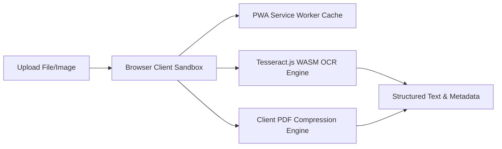

# 📄 DocuShrink AI — Serverless Offline Document Suite

[]()
[]()
[]()

> **"DocuShrink AI is a client-side document processing workspace built with React 19 and TypeScript. By executing WebAssembly-compiled libraries (Tesseract.js for OCR) directly inside the browser sandbox, it processes files 100% locally with $0 server hosting cost."**

---

## ⚡ The Recruiter Takeaway (Why This Matters)
1. **Serverless & Local-First**: Zero server uploads. Heavy operations run in browser RAM—ensuring complete client-side data privacy.
2. **Offline Progressive Web App (PWA)**: Implements Service Workers to cache resources, allowing full functionality when completely disconnected.
3. **Optimized Client Engines**: Houses 10 custom tools, including an offline multithreaded PDF compiler, EXIF metadata stripper, and secure lock tools.

---

## 🏗️ Serverless Sandbox Pipeline



---

## 🛠️ Quick Launch

### 1. Requirements
* Install [Node.js](https://nodejs.org/) (v18.0+).

### 2. Startup Command
```bash
git clone https://github.com/kalyan-1845/Data-Processing-System.git
cd Data-Processing-System
npm install
npm run dev
```
Open [http://localhost:5173](http://localhost:5173) in your browser.