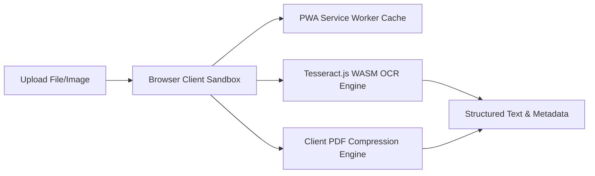

# 📄 DocuShrink AI — Serverless Offline Document Suite

[]()
[]()
[]()
[]()

DocuShrink AI is a client-side document processing workspace built with React 19, TypeScript, and Tailwind CSS. By utilizing client-side web assembly execution cores (Tesseract.js for OCR and custom file parsers), DocuShrink processes files entirely on-device, offering **instant execution, $0 hosting cost, and absolute privacy for sensitive files.**

---

## 🏗️ Serverless Pipeline

DocuShrink executes intensive operations inside the browser Sandbox using Service Workers, removing database and cloud API overhead.



---

## 🛠️ Feature Overview

DocuShrink features **10 production-ready utility tools** operating offline:

1.  **Optical Character Recognition (OCR)**: Extracts structured text from images across 13 major languages using client-side WASM.
2.  **PDF Compressor**: Optimizes page layout structures and downsamples embedded images in the browser to reduce file size up to 70%.
3.  **PDF Merger & Splitter**: Combines multiple documents or extracts individual pages instantly.
4.  **Watermark Tool**: Burn text/image watermarks onto PDFs securely.
5.  **Metadata Editor**: Strip or edit sensitive EXIF and document creator data.
6.  **Secure Lock/Unlock**: Add or remove password protection using local standard PDF encryption rules.
7.  **Offline PWA Support**: Can be installed to the desktop as a standalone app and runs completely offline.

---

## 🚀 How to Run Locally

### Prerequisites
*   **Node.js**: v18.0 or higher
*   **npm** or **yarn**

### Installation Steps

1.  **Clone the Repository**:
    ```bash
    git clone https://github.com/kalyan-1845/Data-Processing-System.git
    cd Data-Processing-System
    ```
2.  **Install Node Dependencies**:
    ```bash
    npm install
    ```
3.  **Launch the Development Server**:
    ```bash
    npm run dev
    ```
4.  Open [http://localhost:5173](http://localhost:5173) in your browser to run the application locally.

### Production Build
To build the static serverless bundle:
```bash
npm run build
```
This generates a `dist/` directory that can be deployed instantly to Netlify, Vercel, or GitHub Pages for $0 hosting cost.

---

## 🔒 Security & Privacy First

DocuShrink AI does not communicate with external servers:
*   **Offline Operation**: You can disconnect from the internet entirely after loading the page.
*   **Zero File Uploads**: Your documents are processed directly in your browser's RAM; no file ever touches a backend server.
*   **Telemetry Free**: Zero analytical scripts, cookie logs, or user session metrics.