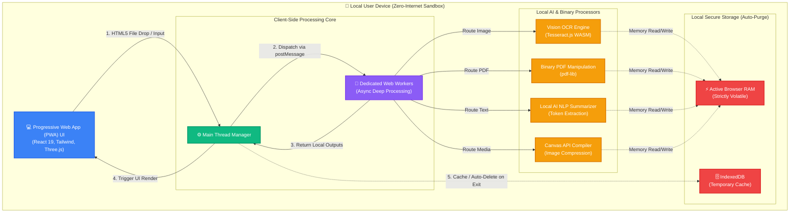

# ⚡ DocuShrink AI: The Neural Document Workspace

<p align="center">
  
</p>

<p align="center">
  <b>High-Performance. 100% Private. 100% Offline.</b><br>
  <i>The definitive state-of-the-art workspace for secure, high-speed document processing.</i>
</p>

<p align="center">
  
  
  
  
</p>

---

## 🌌 The "Neural-Engine" Advantage

DocuShrink AI is engineered to deliver professional-grade document tools with a **Zero-Internet** mandate. By leveraging **Local AI Bundling** and a **Progressive Web App (PWA)** architecture, your data never leaves your device's RAM.

### 🛡️ Privacy First, Always
Unlike cloud-based AI utility sites, DocuShrink runs its "AI Brains" (Workers) entirely in your browser.
*   **Zero-Internet OCR**: Industrial-grade text extraction from images without a Wi-Fi signal.
*   **Localized PDF Logic**: Merge, Split, and Compress files instantly with zero latency.
*   **100% Client-Side**: No backend, no accounts, and absolutely no data tracking.

### 🧠 The Core Suite (10 Tools)
- **AI Summarizer**: Extractive NLP logic for rapid document intelligence.
- **Keyword Extraction**: Thematic mapping using local TF-IDF scoring.
- **Vision OCR**: Industrial-grade text recognition via localized Tesseract.js cores.
- **Question Generation**: Auto-conversion of static text into interactive Q&A.
- **Bullet Points**: Instant extraction of actionable insights.
- **PDF Compressor**: Reduce file sizes locally without quality loss.
- **Image Optimizer**: Batch compress and resize images via Canvas API.
- **Split & Extract**: Granular page extraction from PDF documents.
- **Batch Splitter**: Explode one PDF into multiple single-page documents.
- **Neural PDF Merger**: Combine multiple files into a single master document.

---

## 💎 Premium Experience

- **Custom "Pencil" Cursor**: A precision-weighted, gravity-sensitive custom mouse experience that defines the DocuShrink brand.
- **3D Coalescence Entrance**: A high-fidelity initialization sequence featuring 2,000 magnetic particles (Three.js).
- **Industrial HUD**: A sleek, glassmorphic interface that shifts color categories across the workspace.
- **Neural Particles**: Background telemetry fields that react dynamically to your presence.

---

## 🛠️ The Tech Stack

| Technology | Purpose |
| :--- | :--- |
| **React 19** | Concurrent rendering and state management. |
| **Framer Motion** | Advanced physics-based animations and custom cursor logic. |
| **Three.js** | High-performance 3D visualization and particle systems. |
| **Tesseract.js** | Offline Optical Character Recognition. |
| **pdf-lib** | Binary PDF manipulation and processing. |
| **Vitest** | Comprehensive unit and integration testing. |

---

## 🏛️ System Architecture



---

## ⚡ Quick Start

### 1. Installation
Ensure you have **Node.js** (v18+) installed.

```bash
# Clone the repository
git clone https://github.com/kalyan-1845/Data-Processing-System.git

# Install dependencies
npm install

# Start the high-performance workspace
npm run dev
```

### 2. Build for Production
Create a standalone, portable PWA:
```bash
npm run build
```
The resulting `/dist` folder is a complete, offline-ready application that can be hosted anywhere or even run from a USB drive.

---

## 👥 The Neural Core Team

- **Bhoompally Kalyan Reddy** — [LinkedIn](https://www.linkedin.com/in/bhoompally-kalyanreddy/) | *Lead Architecture & PWA Strategy*
- **G. Pranathieswari** — *UI/UX Design & Branding*
- **Tharuni** — *Logic & Integration*

---

<p align="center">
  <b>DocuShrink AI</b> – Engineered for the next generation of private productivity.
</p>
